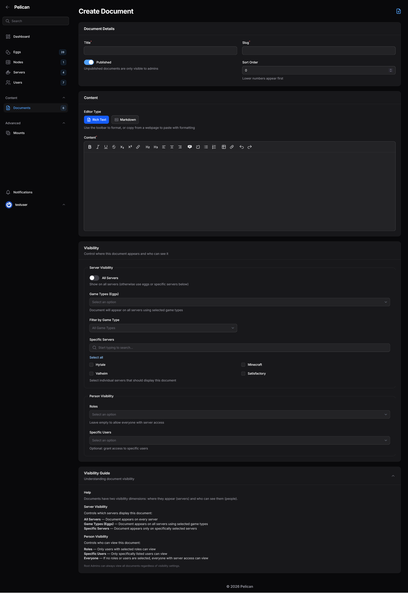
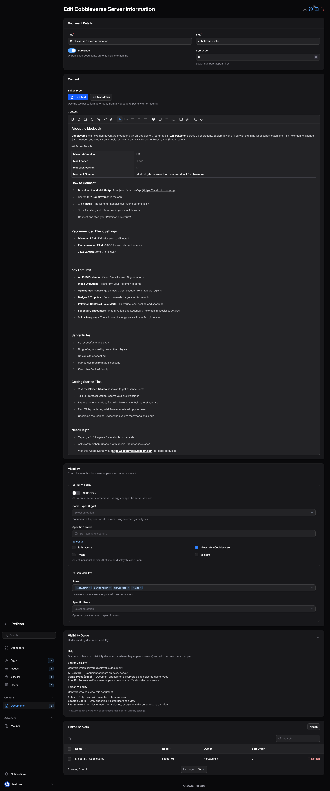
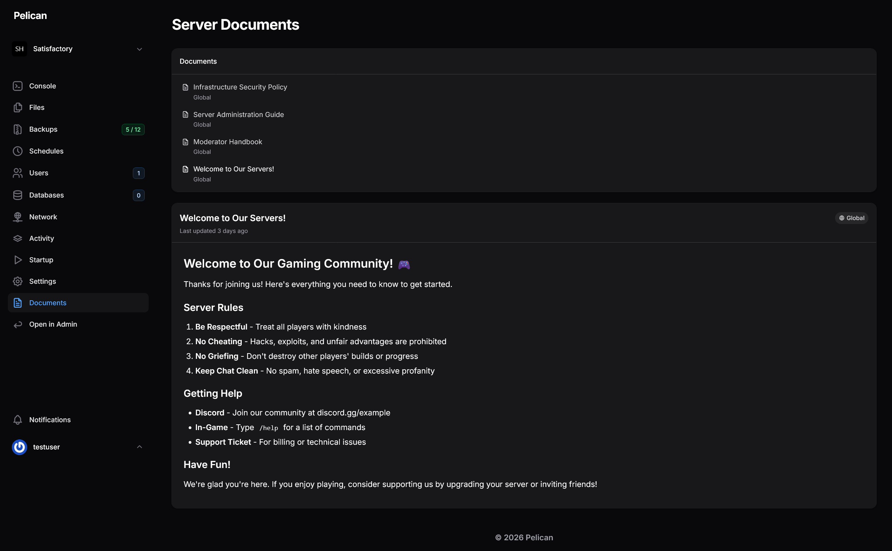

# Server Documentation Plugin for Pelican Panel

A documentation management plugin for [Pelican Panel](https://pelican.dev) that allows administrators to create, organize, and distribute documentation to server users with flexible role-based visibility.

## Features

- **Rich Text Editor** - Full WYSIWYG editing with formatting, lists, code blocks, tables, and more
- **Role-Based Visibility** - Control who sees what documentation using Pelican's existing role system
- **Egg-Based Assignment** - Show documentation on all servers using specific eggs/games
- **Global & Server-Specific Docs** - Create documentation that appears on all servers or only specific ones
- **Server Assignment During Creation** - Assign documents to servers with egg-based filtering when creating
- **Version History** - Track changes with automatic versioning, rate-limited to prevent spam
- **Markdown Import/Export** - Import `.md` files or export documents for backup/migration
- **Server Panel Integration** - Documents appear in the player's server sidebar with search
- **Admin Panel Integration** - Full CRUD management with filtering, search, and bulk actions
- **Drag-and-Drop Reordering** - Easily reorder documents in relation managers
- **Audit Logging** - All document operations are logged for accountability

## Screenshots

### Admin Panel - Document List

*Full document management with Import Markdown action, role badges, and global indicators*

### Admin Panel - Create Document

*Visibility controls with role and egg selection*

### Admin Panel - Edit Document with Linked Servers

*Rich text editor with Servers relation manager showing linked servers*

### Server Panel - Documentation View

*Users see only documents they have access to based on roles*

### Version History

*Version table with change summaries showing character diff (e.g., "+2 chars")*

### Version Preview

*Preview modal showing full content of a previous version*

### Version Restore

*Confirmation dialog before restoring a previous version*

### After Restore

*New version created with "Restored from version X" summary*

## Visibility System

### Two-Dimensional Visibility

Document visibility is controlled by two independent dimensions:

#### 1. Server Visibility (WHERE does it appear?)

| Setting | Behavior |
|---------|----------|
| **Global** | Appears on ALL servers |
| **By Egg** | Appears on servers using selected eggs/games |
| **By Server** | Appears only on explicitly attached servers |

#### 2. Person Visibility (WHO can see it?)

| Setting | Behavior |
|---------|----------|
| **No restrictions** | Anyone with server access can see it |
| **By Role** | Only users with selected roles can see it |
| **By User** | Only explicitly listed users can see it |

### Example Configurations

| Document | Server Visibility | Person Visibility | Result |
|----------|------------------|-------------------|--------|
| Community Rules | Global | None | Everyone sees it on every server |
| Infrastructure Guide | Global | Root Admin role | Only root admins see it, on all servers |
| Minecraft Guide | Minecraft egg | None | Everyone sees it on Minecraft servers only |
| VIP Instructions | Global | VIP role | VIP role members see it on all servers |
| Staff Handbook | Global | Moderator, Admin roles | Staff see it everywhere |

### Root Admin Bypass

Root admins always see all published documents on visible servers, regardless of role/user restrictions.

## Installation

### Requirements
- Pelican Panel v1.0+
- PHP 8.2+

### Install via Admin Panel

1. Download the plugin zip or clone to your plugins directory
2. Navigate to **Admin Panel → Plugins**
3. Click **Install** next to "Server Documentation"
4. Run migrations when prompted

### Manual Installation

```bash
# Copy plugin to plugins directory
cp -r server-documentation /var/www/html/plugins/

# Run migrations
php artisan migrate
```

> **Note**: This plugin has no external composer dependencies - it uses Pelican's bundled packages only.

## Usage

### Creating Documents

1. Go to **Admin Panel → Documents**
2. Click **New Document**
3. Fill in:
   - **Title** - Display name for the document
   - **Slug** - URL-friendly identifier (auto-generated from title)
   - **Published** - Toggle to hide from non-admins while drafting
   - **Sort Order** - Lower numbers appear first in lists
4. **Server Visibility** (choose one):
   - Toggle **All Servers** for global visibility, OR
   - Select **Eggs** to show on all servers using those eggs, OR
   - Select specific **Servers** using checkboxes
5. **Person Visibility** (optional):
   - Select **Roles** to restrict to users with those roles
   - Select **Users** to grant access to specific users
   - Leave empty for everyone with server access
6. Write your content using the rich text editor
7. Click **Save**

### Attaching to Servers (After Creation)

You can also attach documents to servers after creation:

1. Edit the document
2. Scroll to the **Servers** relation manager
3. Click **Attach** and select servers
4. Use drag-and-drop to reorder documents

Or from the server side:
1. Go to **Admin Panel → Servers → [Server] → Documents tab**
2. Click **Attach** and select documents
3. Use drag-and-drop to reorder

### Importing Markdown

1. Go to **Admin Panel → Documents**
2. Click **Import Markdown**
3. Upload a `.md` file
4. Optionally enable "Use YAML Frontmatter" to extract metadata:

```yaml
---
title: My Document
slug: my-document
is_global: false
is_published: true
sort_order: 10
roles:
  - Root Admin
  - Support Staff
users:
  - admin_username
eggs:
  - Minecraft
  - Paper
servers:
  - server-uuid-1
  - server-uuid-2
---

# Document Content

Your markdown content here...
```

### Exporting Documents

1. Edit any document
2. Click the **Download** icon in the header
3. Document downloads as `.md` with YAML frontmatter including roles, users, eggs, and servers

### Version History

1. Edit any document
2. Click the **History** icon (shows badge with version count)
3. View previous versions with timestamps and editors
4. Click **Preview** to see old content
5. Click **Restore** to revert to a previous version

## Configuration

### Environment Variables

All settings can be configured via environment variables or by publishing the config file:

```bash
# Cache Settings
SERVER_DOCS_CACHE_TTL=300              # Cache TTL for document queries (seconds, 0 to disable)
SERVER_DOCS_BADGE_CACHE_TTL=60         # Cache TTL for navigation badge count (seconds)

# Version History
SERVER_DOCS_VERSIONS_TO_KEEP=50        # Max versions per document (0 = unlimited)
SERVER_DOCS_AUTO_PRUNE=false           # Auto-prune old versions on save

# Import Settings
SERVER_DOCS_MAX_IMPORT_SIZE=512        # Max markdown import file size (KB)
SERVER_DOCS_ALLOW_HTML_IMPORT=false    # Allow raw HTML in imports (security risk)

# Permissions
SERVER_DOCS_EXPLICIT_PERMISSIONS=false # Require explicit document permissions

# Audit Logging
SERVER_DOCS_AUDIT_LOG_CHANNEL=single   # Log channel for audit events
```

### Admin Permissions

By default, users with server management permissions (`update server` or `create server`) can manage documents. Set `SERVER_DOCS_EXPLICIT_PERMISSIONS=true` to require explicit document permissions instead.

The plugin registers these Gates:

- `viewList document`
- `view document`
- `create document`
- `update document`
- `delete document`

To extend access to other admin roles, modify the `registerDocumentPermissions()` method in the ServiceProvider.

### Customization

The plugin uses Pelican's standard extensibility patterns:

```php
// In another plugin or service provider
use Starter\ServerDocumentation\Filament\Admin\Resources\DocumentResource;

// Modify the form
DocumentResource::modifyForm(function (Form $form) {
    return $form->schema([
        // Add custom fields
    ]);
});

// Modify the table
DocumentResource::modifyTable(function (Table $table) {
    return $table->columns([
        // Add custom columns
    ]);
});
```

## File Structure

```text
server-documentation/
├── composer.json              # PSR-4 autoloading (no external deps)
├── config/server-documentation.php  # Configuration options
├── plugin.json                # Plugin metadata
├── database/
│   ├── factories/             # Model factories for testing
│   └── migrations/            # Database schema
├── lang/en/strings.php        # Translations (i18n ready)
├── resources/
│   ├── css/                   # Document content styling
│   └── views/filament/        # Blade templates
├── tests/
│   ├── Unit/                  # Unit tests (Pest)
│   └── Feature/               # Feature tests
└── src/
    ├── Models/                # Document, DocumentVersion
    ├── Policies/              # DocumentPolicy, DocumentVersionPolicy
    ├── Providers/             # Service provider
    ├── Services/              # DocumentService, MarkdownConverter
    └── Filament/
        ├── Admin/             # Admin panel resources
        ├── Concerns/          # Shared traits (HasDocumentTableColumns)
        └── Server/            # Server panel pages
```

## Database Schema

```text
documents
├── id, uuid
├── title, slug (unique)
├── content (HTML from rich editor)
├── is_global, is_published
├── sort_order
├── author_id, last_edited_by
├── timestamps, soft_deletes

document_versions
├── id, document_id
├── title, content (snapshot)
├── version_number
├── edited_by, change_summary
├── created_at

document_server (pivot)
├── document_id, server_id
├── sort_order
├── timestamps

document_role (pivot)
├── document_id, role_id
├── timestamps

document_user (pivot)
├── document_id, user_id
├── timestamps

document_egg (pivot)
├── document_id, egg_id
├── timestamps
```

## Testing

The plugin includes unit tests using Pest PHP:

```bash
# Run all tests
cd /path/to/pelican-panel
php artisan test --filter=ServerDocumentation

# Run specific test file
php artisan test plugins/server-documentation/tests/Unit/Services/DocumentServiceTest.php

# Run with coverage
php artisan test --filter=ServerDocumentation --coverage
```

### Test Coverage

- **DocumentService** - Version creation, caching, permission checks
- **MarkdownConverter** - HTML↔Markdown conversion, sanitization, frontmatter
- **DocumentPolicy** - Authorization for admin and server panel
- **DocumentVersionPolicy** - Version access control
- **Document Model** - Events, scopes, relationships, visibility helpers

## Contributing

This plugin was developed for [Pelican Panel](https://pelican.dev). Contributions welcome!

1. Fork the repository
2. Create a feature branch
3. Make your changes
4. Run tests: `php artisan test --filter=ServerDocumentation`
5. Submit a pull request

## License

MIT License - see [LICENSE](LICENSE) for details.

## Credits

- Built for [Pelican Panel](https://pelican.dev)
- Uses Pelican's bundled [League CommonMark](https://commonmark.thephpleague.com/) for Markdown→HTML parsing
- Built-in HTML→Markdown converter for exports (no external dependencies)
