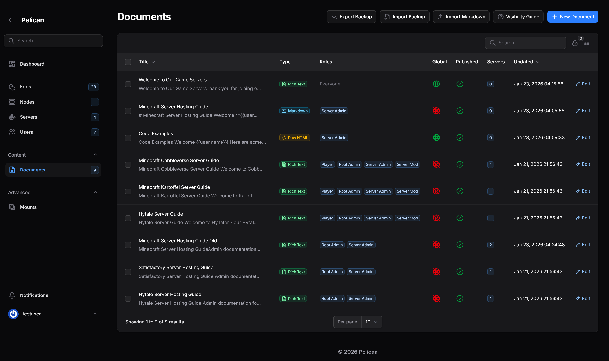

# Server Documentation Plugin for Pelican Panel

A documentation management plugin for [Pelican Panel](https://pelican.dev) that allows administrators to create, organize, and distribute documentation to server users with flexible role-based visibility.

## Quick Install

### Download

[](https://github.com/gavinmcfall/pelican-plugins/releases/latest/download/server-documentation.zip)

### Requirements
- Pelican Panel v1.0.0-beta31+
- PHP 8.2+

### Install via Admin Panel (Recommended)

1. Click the **Download** button above to get `server-documentation.zip`
2. In Pelican Panel: **Admin → Plugins → Upload**
3. Select the zip file and upload
4. Click **Install** when prompted

### Manual Installation

```bash
# Copy plugin to plugins directory
cp -r server-documentation /var/www/html/plugins/

# Run migrations
php artisan migrate

# Publish CSS assets (required for document styling)
php artisan vendor:publish --tag=server-documentation-assets
```

> **Note**: This plugin has no external composer dependencies - it uses Pelican's bundled packages only.

---

## Updating to a New Version

> **⚠️ Important**: Pelican does not allow uploading over an existing plugin. Choose the method that works for your setup:

### Method 1: Export/Import (Recommended - No SSH Required)

**Fully UI-based workflow** - works for all users:

1. **Export your documents**
   - Go to **Admin → Documents** in Pelican Panel
   - Click **Export JSON** button in the top-right
   - Save the JSON backup file

2. **Uninstall old version**
   - Go to **Admin → Plugins**
   - Click **Uninstall** next to Server Documentation
   - ⚠️ This deletes documents from database (but you have the backup!)

3. **Install new version**
   - Download `server-documentation.zip` from the [latest release](https://github.com/gavinmcfall/pelican-plugins/releases/latest)
   - Go to **Admin → Plugins → Upload**
   - Select the zip file and install

4. **Import your documents**
   - Go to **Admin → Documents**
   - Click **Import JSON** button
   - Upload the backup file from step 1
   - All documents, versions, and settings are restored!

### Method 2: Manual File Replacement (Requires SSH)

**For users with server access** - no data loss risk:

```bash
# 1. SSH into your Pelican server
cd /var/www/html/plugins

# 2. Download and extract new version
wget https://github.com/gavinmcfall/pelican-plugins/releases/latest/download/server-documentation.zip
unzip -o server-documentation.zip
rm server-documentation.zip

# 3. Clear caches
cd /var/www/html
php artisan optimize:clear
```

Your documents stay in the database - only plugin code is replaced.

---

## Upgrading from v1.0.x

> **⚠️ IMPORTANT: Read this section carefully if you have existing documents you want to keep!**

Version 1.1.0+ includes database schema changes. Use one of these methods to preserve your documents:

### Method 1: Export/Import (Recommended)

**No SSH required** - works for all users:

1. In v1.0.x: **Admin → Documents → Export JSON** (save the backup)
2. Uninstall v1.0.x via **Admin → Plugins**
3. Install v1.1.0+ via **Admin → Plugins → Upload**
4. **Admin → Documents → Import JSON** (upload the backup)

All documents, versions, roles, and settings are restored!

### Method 2: Pre-Upgrade Patch (Advanced)

**For users who prefer to keep data in database** during upgrade:

```bash
# 1. SSH into your server
cd /var/www/pelican

# 2. Run the pre-upgrade patch (prevents data loss on uninstall)
php plugins/server-documentation/scripts/pre-upgrade-patch.php

# 3. Uninstall via Admin Panel → Plugins → Uninstall
#    (Documents preserved in database due to patch)

# 4. Upload and install the new version
#    (Migrations detect existing tables and update schema)

# 5. Clear caches
php artisan optimize:clear
```

**What the patch does**: Modifies migration `down()` methods to be no-ops, preventing table drops during uninstall.

### If you DON'T need to keep existing documents:

Simply uninstall the old version and install the new one. All document data will be removed and fresh tables created.

---

## Features

- **Three Editor Modes** - Choose Rich Text (WYSIWYG), Markdown, or Raw HTML per document
- **Template Variables** - Use `{{user.name}}`, `{{server.name}}`, etc. in documents
- **Syntax Highlighting** - Code blocks are automatically highlighted in previews and server view
- **JSON Backup/Restore** - Export all documents with full configuration, import on another instance
- **Role-Based Visibility** - Control who sees what documentation using Pelican's role system
- **Egg-Based Assignment** - Show documentation on all servers using specific eggs/games
- **Global & Server-Specific Docs** - Create documentation that appears on all servers or only specific ones
- **Version History** - Track changes with automatic versioning, rate-limited to prevent spam
- **Markdown Import/Export** - Import `.md` files or export individual documents
- **Server Panel Integration** - Documents appear in the player's server sidebar
- **Admin Panel Integration** - Full CRUD management with filtering, search, and bulk actions
- **Drag-and-Drop Reordering** - Easily reorder documents in relation managers
- **Audit Logging** - All document operations are logged for accountability

---

## Screenshots

### Admin Panel - Document List

*Full document management with type badges, role indicators, and global status*

### Admin Panel - Editor Type Selection

*Choose between Rich Text, Markdown, or Raw HTML when creating documents*

### Admin Panel - Rich Text Editor

*WYSIWYG editor with formatting toolbar and visibility controls*

### Admin Panel - Markdown Editor

*Markdown editor with live preview showing rendered content*

### Admin Panel - Raw HTML Editor

*Raw HTML editor with syntax-highlighted preview*

### Server Panel - Document View

*Users see formatted documents based on their role permissions*

### Server Panel - Code Examples

*Syntax highlighting for code blocks in multiple languages*

### Import/Export

*Import Markdown files with optional YAML frontmatter*


*Restore documents from JSON backup*

### Version History

*Version table with change summaries showing character diff*


*Preview modal showing full content of a previous version*

---

## Editor Types

### Rich Text (WYSIWYG)
- Toolbar with formatting options (bold, italic, lists, links, etc.)
- Paste formatted content directly from web pages
- Best for non-technical users

### Markdown
- Write in Markdown syntax
- Live preview shows rendered HTML
- Supports tables, code blocks, and all standard Markdown features

### Raw HTML
- Full control over HTML output
- Syntax highlighting in editor
- Best for advanced formatting or embedding content

All editor types support **template variables** that are replaced when displayed to users.

---

## Template Variables

Use these variables in your document content - they're replaced with actual values when displayed:

| Variable | Description |
|----------|-------------|
| `{{user.name}}` | Current user's display name |
| `{{user.username}}` | Current user's username |
| `{{user.email}}` | Current user's email |
| `{{server.name}}` | Server name |
| `{{server.uuid}}` | Server UUID |
| `{{server.egg}}` | Game type name |
| `{{server.node}}` | Node name |
| `{{server.memory}}` | Allocated memory (MB) |
| `{{server.disk}}` | Allocated disk (MB) |
| `{{server.cpu}}` | CPU limit (%) |
| `{{date}}` | Current date (Y-m-d) |
| `{{time}}` | Current time (H:i) |
| `{{datetime}}` | Current date and time |
| `{{year}}` | Current year |

To display a literal variable without replacement, escape it: `\{{user.name}}`

---

## Visibility System

### Two-Dimensional Visibility

Document visibility is controlled by two independent dimensions:

#### 1. Server Visibility (WHERE does it appear?)

| Setting | Behavior |
|---------|----------|
| **Global** | Appears on ALL servers |
| **By Egg** | Appears on servers using selected eggs/games |
| **By Server** | Appears only on explicitly attached servers |

#### 2. Person Visibility (WHO can see it?)

| Setting | Behavior |
|---------|----------|
| **No restrictions** | Anyone with server access can see it |
| **By Role** | Only users with selected roles can see it |
| **By User** | Only explicitly listed users can see it |

### Example Configurations

| Document | Server Visibility | Person Visibility | Result |
|----------|------------------|-------------------|--------|
| Community Rules | Global | None | Everyone sees it on every server |
| Infrastructure Guide | Global | Root Admin role | Only root admins see it, on all servers |
| Minecraft Guide | Minecraft egg | None | Everyone sees it on Minecraft servers only |
| VIP Instructions | Global | VIP role | VIP role members see it on all servers |
| Staff Handbook | Global | Moderator, Admin roles | Staff see it everywhere |

### Root Admin Bypass

Root admins always see all published documents on visible servers, regardless of role/user restrictions.

---

## Backup & Restore

### Export All Documents (JSON Backup)

1. Go to **Admin Panel → Documents**
2. Click **Export Backup**
3. Confirm the export
4. JSON file downloads with all documents, settings, and version history

The backup includes:
- All document content and metadata
- Server, egg, role, and user assignments
- Complete version history
- Portable format (uses UUIDs and names, not database IDs)

### Import from Backup

1. Go to **Admin Panel → Documents**
2. Click **Import Backup**
3. Upload the JSON file
4. Toggle **Overwrite Existing** if you want to update documents with matching UUIDs
5. Click **Submit**

### Import Single Markdown File

1. Go to **Admin Panel → Documents**
2. Click **Import Markdown**
3. Upload a `.md` file
4. Enable **Use YAML Frontmatter** to extract metadata:

```yaml
---
title: My Document
slug: my-document
is_global: false
is_published: true
sort_order: 10
roles:
  - Root Admin
  - Support Staff
users:
  - admin_username
eggs:
  - Minecraft
  - Paper
servers:
  - server-uuid-1
  - server-uuid-2
---

# Document Content

Your markdown content here...
```

### Export Single Document

1. Edit any document
2. Click the **Download** icon in the header
3. Document downloads as `.md` with YAML frontmatter

---

## Usage

### Creating Documents

1. Go to **Admin Panel → Documents**
2. Click **New Document** and select editor type:
   - **Rich Text** - WYSIWYG editor
   - **Markdown** - Markdown with live preview
   - **Raw HTML** - Direct HTML editing
3. Fill in:
   - **Title** - Display name for the document
   - **Slug** - URL-friendly identifier (auto-generated)
   - **Published** - Toggle to hide from non-admins while drafting
   - **Sort Order** - Lower numbers appear first
4. **Server Visibility** (choose one):
   - Toggle **All Servers** for global visibility, OR
   - Select **Eggs** to show on servers using those eggs, OR
   - Select specific **Servers** using checkboxes
5. **Person Visibility** (optional):
   - Select **Roles** to restrict to users with those roles
   - Select **Users** to grant access to specific users
   - Leave empty for everyone with server access
6. Write your content
7. Click **Create** or **Save Changes**

### Version History

1. Edit any document
2. Click the **History** icon (shows badge with version count)
3. View previous versions with timestamps and editors
4. Click **Preview** to see old content
5. Click **Restore** to revert to a previous version

---

## Configuration

### Environment Variables

```bash
# Cache Settings
SERVER_DOCS_CACHE_TTL=300              # Cache TTL for document queries (seconds, 0 to disable)
SERVER_DOCS_BADGE_CACHE_TTL=60         # Cache TTL for navigation badge count (seconds)

# Version History
SERVER_DOCS_VERSIONS_TO_KEEP=50        # Max versions per document (0 = unlimited)
SERVER_DOCS_AUTO_PRUNE=false           # Auto-prune old versions on save

# Import Settings
SERVER_DOCS_MAX_IMPORT_SIZE=512        # Max markdown import file size (KB)
SERVER_DOCS_ALLOW_HTML_IMPORT=false    # Allow raw HTML in imports (security risk)

# Permissions
SERVER_DOCS_EXPLICIT_PERMISSIONS=false # Require explicit document permissions

# Audit Logging
SERVER_DOCS_AUDIT_LOG_CHANNEL=single   # Log channel for audit events
```

---

## Docker / Kubernetes Deployment

This plugin has been tested with the official Pelican Docker image in Kubernetes environments.

**Important considerations:**

1. **Plugin Directory**: Store plugins in a persistent volume at `/pelican-data/plugins/`

2. **CSS Assets**: Publish to the public directory on container startup:
   ```bash
   mkdir -p /var/www/html/public/plugins/server-documentation/css/
   cp /pelican-data/plugins/server-documentation/resources/css/* \
      /var/www/html/public/plugins/server-documentation/css/
   ```

3. **Migrations**: Run after installation:
   ```bash
   php artisan migrate --force
   ```

4. **Cache**: Clear after updates:
   ```bash
   php artisan cache:clear
   php artisan view:clear
   php artisan optimize:clear
   ```

**Example Kubernetes init container:**
```yaml
initContainers:
  - name: setup-plugins
    image: ghcr.io/pelican-dev/panel:v1.0.0-beta31
    command:
      - /bin/sh
      - -c
      - |
        mkdir -p /var/www/html/public/plugins/server-documentation/css/
        cp -r /pelican-data/plugins/server-documentation/resources/css/* \
              /var/www/html/public/plugins/server-documentation/css/ 2>/dev/null || true
    volumeMounts:
      - name: data
        mountPath: /pelican-data
      - name: public-assets
        mountPath: /var/www/html/public/plugins
```

---

## File Structure

```text
server-documentation/
├── composer.json              # PSR-4 autoloading (no external deps)
├── config/server-documentation.php  # Configuration options
├── plugin.json                # Plugin metadata
├── database/
│   ├── factories/             # Model factories for testing
│   └── migrations/            # Database schema
├── lang/en/strings.php        # Translations (i18n ready)
├── resources/
│   ├── css/                   # Document content styling
│   └── views/filament/        # Blade templates
├── scripts/
│   └── pre-upgrade-patch.php  # v1.0.x → v1.1.x upgrade helper
└── src/
    ├── Models/                # Document, DocumentVersion
    ├── Policies/              # DocumentPolicy, DocumentVersionPolicy
    ├── Providers/             # Service provider
    ├── Services/              # DocumentService, MarkdownConverter, VariableProcessor
    └── Filament/
        ├── Admin/             # Admin panel resources
        ├── Concerns/          # Shared traits
        └── Server/            # Server panel pages
```

---

## Contributing

This plugin was developed for [Pelican Panel](https://pelican.dev). Contributions welcome!

### Development Setup

```bash
# Clone your fork
git clone https://github.com/YOUR_USERNAME/pelican-plugins.git
cd pelican-plugins/server-documentation

# Install dependencies
composer install
```

### Code Style

This project uses [Laravel Pint](https://laravel.com/docs/pint) for consistent code formatting.

**Before submitting a PR**, run Pint to format your code:

```bash
# Check code style
composer pint:test

# Fix code style
composer pint
```

### Pull Request Workflow

1. Fork the repository
2. Create a feature branch (`git checkout -b feature/amazing-feature`)
3. Make your changes
4. Run code formatter (`composer pint`)
5. Run tests (`composer test`)
6. Commit your changes (`git commit -m 'Add amazing feature'`)
7. Push to the branch (`git push origin feature/amazing-feature`)
8. Submit a pull request

### Code Style Rules

- **PSR-12** compliant via Laravel Pint
- Use **type hints** for parameters and return types
- Add **PHPDoc blocks** for complex methods
- Follow **Laravel naming conventions**

## License

MIT License - see [LICENSE](LICENSE) for details.

## Credits

- Built for [Pelican Panel](https://pelican.dev)
- Uses Pelican's bundled [League CommonMark](https://commonmark.thephpleague.com/) for Markdown parsing
- Syntax highlighting via [highlight.js](https://highlightjs.org/)
